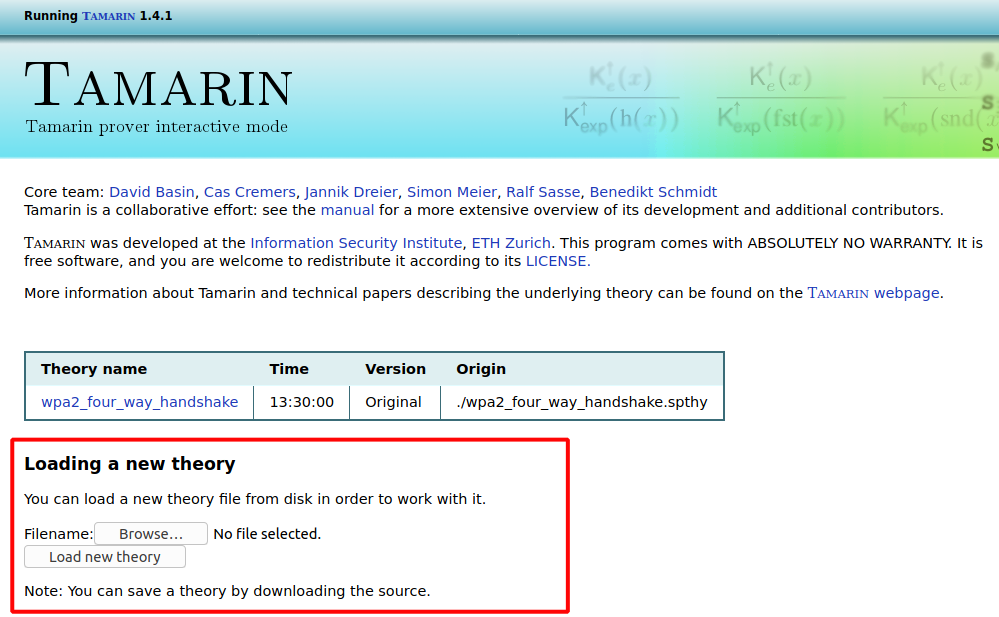
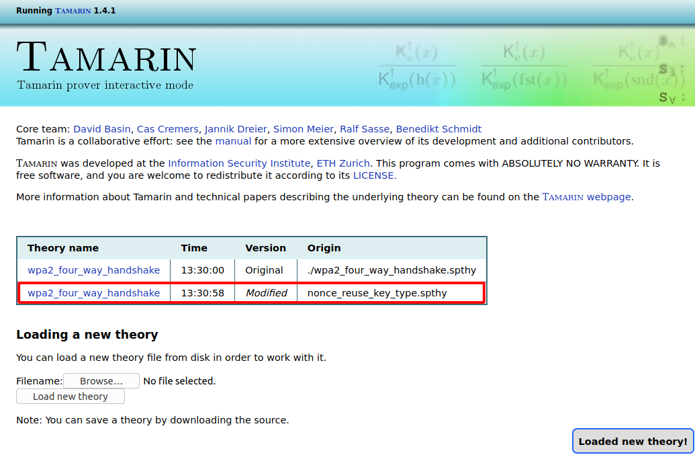

# A Formal Analysis of IEEE 802.11's WPA2

This repository contains a formal model of IEEE 802.11's WPA2 protocol together with proofs of several security properties. The model is created for the theorem prover [Tamarin](https://tamarin-prover.github.io/) and is discussed in a USENIX submission that is currently under review.

## Prerequisites

To produce our formal model we used the [Tamarin prover](https://tamarin-prover.github.io/) (version 1.4.1). Installation instructions for Tamarin can be found [here](https://tamarin-prover.github.io/manual/book/002_installation.html). You need Tamarin to inspect the model, run proofs, and verify existing proofs. Note that Tamarin runs on Linux and Mac, but not on Windows. If you plan to use or edit the model, you also need the [GNU M4 macro processor](https://www.gnu.org/software/m4/).

## Files of the Formal Model

The main file, containing the formal model of WPA2 together with all lemmas, is [model/wpa2_four_way_handshake.m4](model/wpa2_four_way_handshake.m4). This file needs to be preprocessed with the [GNU M4 macro processor](https://www.gnu.org/software/m4/) to turn it into valid input for Tamarin (see below for details). 

If you don't want to use M4 and are only interested in the resulting Tamarin files, then the following two files will be enough for you (note that although these files can be read by Tamarin, the original M4 file is more readable):

* [model/wpa2_four_way_handshake_patched.spthy](model/wpa2_four_way_handshake_patched.spthy) - A formal model of WPA2 including patches/countermeasures aimed at avoiding key-reinstallation attacks.

* [model/wpa2_four_way_handshake_unpatched.spthy](model/wpa2_four_way_handshake_unpatched.spthy) - A formal model of WPA2 without the patches/countermeasures.

The first file is obtained from [wpa2_four_way_handshake.m4](model/wpa2_four_way_handshake.m4) by runnning the following command:

`m4 wpa2_four_way_handshake.m4 > wpa2_four_way_handshake_patched.spthy`

The second file is obtained from [wpa2_four_way_handshake.m4](model/wpa2_four_way_handshake.m4) by setting the M4 macro `INCLUDE_PATCHES` to *false* in the header (line 6) of [wpa2_four_way_handshake.m4](model/wpa2_four_way_handshake.m4) and then running:

`m4 wpa2_four_way_handshake.m4 > wpa2_four_way_handshake_unpatched.spthy`

Note that the formal model of the WPA2 encryption layer (discussed in our paper) is specified in the file [model/encryption_layer.m4i](model/encryption_layer.m4i), which is included by [model/wpa2_four_way_handshake.m4](model/wpa2_four_way_handshake.m4).

## Overview of the Model

The model file [wpa2_four_way_handshake.m4](model/wpa2_four_way_handshake.m4) consists of the following parts (in the same order as presented here):

* Several definitions of constants/macros as well as definitions of function symbols and an equation defining nonce-based encryption/decryption.

* Restrictions (starting at line 34) that handle (1) Checks for equality and inequality (used, e.g., for modeling the verification of message integrity codes), (2) a FIFO restriction for the message queue, which is part of the encryption layer, (3) the replay-counter mechanisms (on the receiver side) and (4) restrictions for modeling memory allocation. **Note that (in contrast to the illustrative example in Section 2 of our paper), replay counters on the sender side are not modeled/restricted with restrictions.**

* Setup/Creation of supplicants and authenticators as well as a rule for associating authenticator threads with supplicant threads (starting at line 122).

* The encryption layer (mostly defined in [model/encryption_layer.m4i](model/encryption_layer.m4i)) as well as rules for modeling nonce reuse and key compromise (starting at line 186).

* The authenticator state machine for the four-way handshake (starting at line 279) followed by the supplicant state machine for the four-way handshake (starting at line 467)

* The group-key handshake state machines for the supplicant (starting at line 670) and for the authenticator (starting at line 715)

* The state machines for the communication related to WNM sleep mode, starting with the part for the authenticator (from line 875), followed by the part for the supplicant (from line 939).

The rest of the file then contains all lemmas, followed by existential statements that serve as plausibility checks. The final lemma (*krack_attack_ptk* at line 1785) is an existential statement for the KRACK attack on the four-way handshake (see below).

## Proof Files

The proofs of all lemmas (in the patched model) are contained in the folders [automatic_proofs](automatic_proofs) (contains the automatically generated proofs) and [manual_proofs](manual_proofs) (contains the manually produced proofs). Each proof file is named after the lemma it proves, with the suffix '.spthy'. For example, the proof of lemma 'authenticator_ptk_is_secret' is in the file [automatic_proofs/authenticator_ptk_is_secret.spthy](automatic_proofs/authenticator_ptk_is_secret.spthy). 

Each proof file contains the whole formal model as well as all the lemmas. Only the lemma for which a proof was generated also has a corresponding proof in the file (for the other lemmas, no proof is in the file).

### Inspecting Proofs with Tamarin

To inspect proofs, you can use the so-called *interactive mode* of the Tamarin prover. The interactive mode can be started as follows:

1. Call the command `tamarin-prover interactive .` from within a directory of your choice (we recommend to start interactive mode in a folder different from [automatic_proofs](automatic_proofs), because otherwise Tamarin runs on all the files in this folder, which could take very long).

2. Start the Firefox browser and open the URL http://localhost:3001.

3. Load a proof file by clicking **Browse...** and choosing one of the proof files. Once you've chosen a file, click **Load new theory**:

4. The proof file should now show up in the list of lemmas (see below). By clicking on the theory name for a given file, you can open the file. Note that this can take a while for larger proofs:

5. Once a proof file has been loaded successfully, the list of lemmas is shown on the left of the page. Scroll to the corresponding lemma to see its proof. If a proof is colored green and ends with *qed*, it means that Tamarin could successfully check the correctness of the proof:

### Generating the Proofs

If you want to generate the proofs for the lemmas of our formal model (except for the ones we proved manually), you can proceed as follows:

1. Open a terminal and go to the root directory of this repository.

2. Execute the script *./proof_generation/generate_proofs.sh* (Command: `./proof_generation/generate_proofs.sh`). Note that it is important to call this script from the root directory and not from some other directory.

3. The proofs for the lemmas will now be generated. The status of each lemma is printed to the terminal. Overall, this should take around one hour on a machine with 16 GB of memory. Our script calls Tamarin via the tool [UT Tamarin](https://github.com/benjaminkiesl/ut_tamarin); UT Tamarin is a wrapper for Tamarin that allows the convenient generation of multiple proofs. Note that UT Tamarin is compiled on the spot, which requires the [g++ compiler](https://gcc.gnu.org/) (Version 7.5 or newer). Moreover, UT Tamarin requires an installed version of Tamarin as well as of the [GNU M4 macro processor](https://www.gnu.org/software/m4/).

When the script is finished, all automatically generated proofs can be found in the directory *./automatic_proofs*.

## KRACK Attack

The folder [traces](traces) contains a Tamarin file with an attack trace for a [KRACK attack](https://www.krackattacks.com/) on the WPA2 four-way handshake (in file [krack_attack_ptk.spthy](traces/krack_attack_ptk.spthy)). The attack is on the unpatched model, i.e., the version of the model that does not contain the countermeasures aimed at preventing key-reinstallation attacks. A corresponding picture (produced by Tamarin) showing the attack trace is also contained in the folder: [krack_attack_ptk.png](traces/krack_attack_ptk.png).

In the picture of the trace, the authenticator is colored purple whereas the supplicant is colored blue. Notice how the rule *Supp_Install_Key_Snd_M4* occurs twice, leading to the reinstallation of the PTK `KDF(<~PMK, ~ANonce, ~SNonce>)`. This resets the corresponding nonce. Since the supplicant sends two different messages (yellow rule *sendPTKEncryptedPayloadSupp*) with the same key and the same nonce, this allows the attacker to learn the PTK with the (red) rule *KeyRevealFromNonceReuse*.
